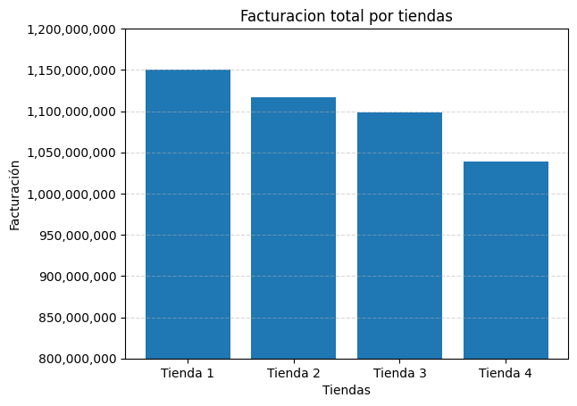
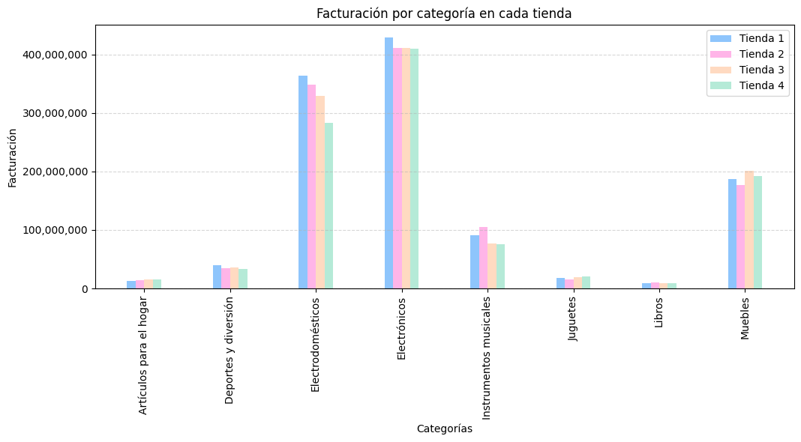
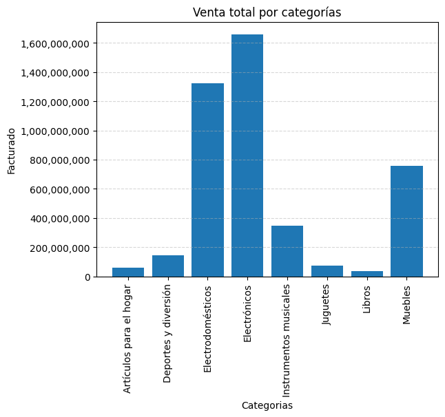
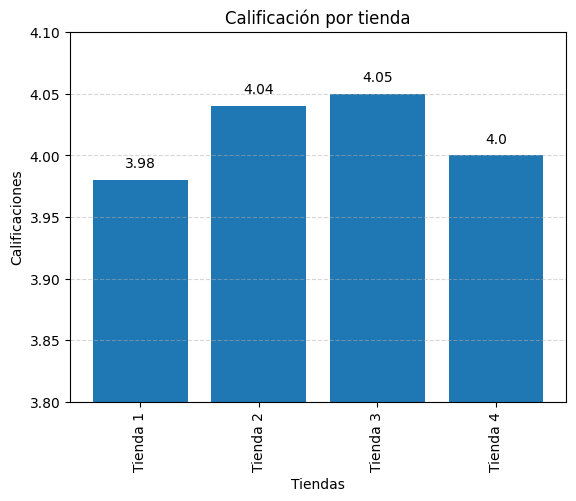
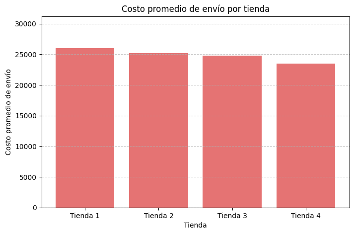

# challenge-alura-store

## Proyecto de análisis de las tiendas de propiedad del señor Juan para decidir cual de ellas debiese ser la tienda a vender.

### Para llevar a cabo el análisis se adquieren datos de sus 4 tiendas y se analizan a profundidad distintos aspectos de este: 

1.  Análisis de facturación 
2. Ventas por categoría
3. Calificación promedio de la tienda
4. Productos más y menos vendidos
5. Envío promedio por tienda.

## Cuadros de los respectivos análsis por cada item

Gráfico 1: Ventas por tienda

Gráfico 2: Facturación por categoria en cada tienda

Gráfico 3: Venta total por categorías

Gráfico 4: Calificación por tienda

Gráfico 5: Costo promedio total por envíos

## En conclusión respecto a los análisis realizados a los datos de cada tienda, se recomienda que la tienda a vender, sea la tienda N°4
